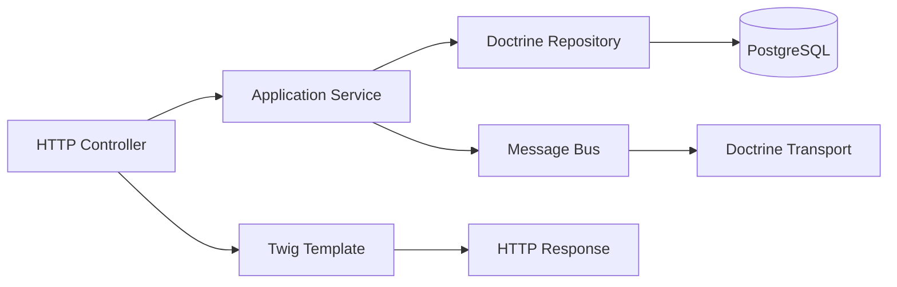

# Architecture

The macro technical shape: the stack, how the pieces fit, and the decisions behind them. Point to the code, do not restate it.

## Stack

- PHP 8.2+ with Composer
- Symfony 7.4 framework with Flex for dependency management
- Doctrine ORM for database persistence with PostgreSQL
- Twig for server-side templating
- Symfony Messenger with Doctrine transport for async message processing
- PostgreSQL via Docker Compose for local development
- Mailpit via Docker Compose for local email testing

## How it fits together

The macro flow between the main parts. One box per area, high level only.

## Key decisions

- Symfony Flex for modern dependency management and recipe system
- Doctrine ORM for database abstraction with migrations for schema management
- Twig for templating to separate presentation from logic
- Symfony Messenger for decoupled async processing
- Docker Compose for consistent local development environment
- PHPStan for static analysis to catch bugs early
- Pest for modern, readable testing

## Gotchas

- Empty Controller, Entity, and Repository directories - project is a starter template
- Security bundle configured but no actual auth implementation yet
- Messenger configured but no actual message handlers yet
