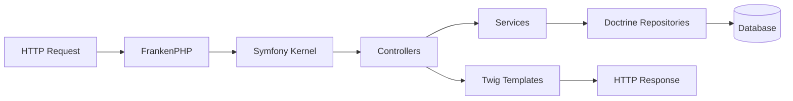

# Architecture

The macro technical shape: the stack, how the pieces fit, and the decisions behind them. Point to the code, do not restate it.

## Stack

- PHP 8.2+ with Symfony 7.4 full-stack framework
- FrankenPHP as PHP application server in Docker containers
- Twig for templating, Doctrine for ORM
- Pest for testing, PHPStan for static analysis

## How it fits together

The macro flow between the main parts. One box per area, high level only.



## Key decisions

- Docker-based development environment for consistency across platforms
- FrankenPHP for modern PHP application serving
- Symfony 7.4 for latest features and long-term support

## Gotchas

- Docker configuration in `.docker/frankenphp/` for local development

## Domain-Driven Design (DDD) & Clean Architecture

### Structure
Code organized by **bounded contexts** (business capabilities) with strict layer separation. See `src/` for implementation.

```
src/
├── {BoundedContext}/          # e.g. User/, Billing/
│   ├── Domain/               # Business rules (entities, value objects, repository interfaces)
│   ├── Application/          # Use cases (commands, queries, handlers)
│   └── Infrastructure/       # Technical details (Doctrine, API clients, controllers)
└── Shared/                   # Cross-cutting concerns (Kernel, Bus, exceptions)
```

### Layers
| Layer | Responsibility | Can depend on | Cannot depend on |
|-------|----------------|---------------|-------------------|
| Domain | Business rules | Shared/Domain | Symfony, Doctrine, Infrastructure |
| Application | Use case coordination | Domain, Shared/Application | Infrastructure |
| Infrastructure | Technical implementation | All | - |

### Key Decisions
- **Bounded Contexts**: Group code by business capability (User, Billing), not by technical type (Controller, Entity)
- **Doctrine Mappings**: External YAML files in `config/doctrine/` to decouple Domain from ORM
- **CQRS**: Available but optional; use only when read/write have different requirements (e.g. projections, caching)
- **Event-Driven**: 
  - Synchronous events via `EventDispatcher` (immediate, atomic)
  - Asynchronous via Messenger (long-running, retryable)
- **Architecture Enforcement**: Pest Arch Testing (see `tests/Architecture/`)
