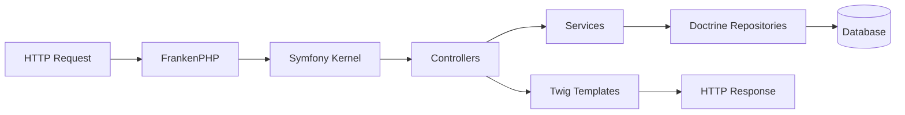

# Architecture

The macro technical shape: the stack, how the pieces fit, and the decisions behind them. Point to the code, do not restate it.

## Stack

- PHP 8.2+ with Symfony 7.4 full-stack framework
- FrankenPHP as PHP application server in Docker containers
- Twig for templating, Doctrine for ORM
- Pest for testing, PHPStan for static analysis

## How it fits together

The macro flow between the main parts. One box per area, high level only.

## Key decisions

- Docker-based development environment for consistency across platforms
- FrankenPHP for modern PHP application serving
- Symfony 7.4 for latest features and long-term support

## Gotchas

- Docker configuration in `.docker/frankenphp/` for local development