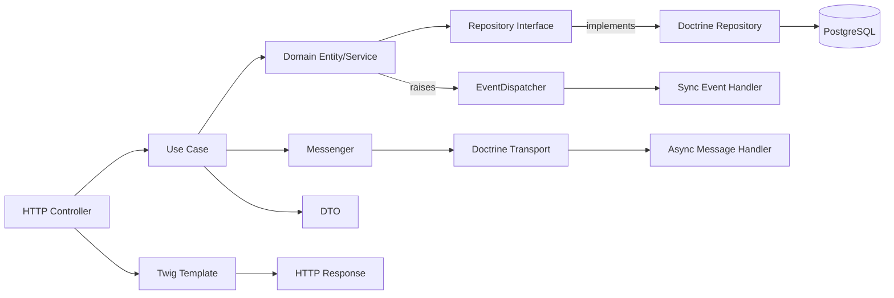

# Architecture

The macro technical shape: the stack, how the pieces fit, and the decisions behind them. Point to the code, do not restate it.

## Stack

- PHP 8.2+ with Composer
- Symfony 7.4 framework with Flex for dependency management
- Doctrine ORM for database persistence with PostgreSQL
- Twig for server-side templating
- Symfony Messenger with Doctrine transport for async message processing
- PostgreSQL via Docker Compose for local development
- Mailpit via Docker Compose for local email testing

## Architecture Pattern: Clean Architecture + Hexagonal + DDD

The project follows **Clean Architecture** principles (Uncle Bob) with **Hexagonal** (Ports & Adapters) and **DDD-lite** influences.

### Layer Structure

```
src/
├── Domain/                  # Domain Layer (Clean Architecture)
│   ├── User/                # Bounded Context (logical separation via namespace)
│   │   ├── Entity/          # Domain entities with business rules
│   │   │   └── User.php
│   │   ├── ValueObject/     # Immutable value objects
│   │   │   └── Email.php
│   │   ├── Repository/      # Ports: Repository interfaces
│   │   │   └── UserRepositoryInterface.php
│   │   └── Event/           # Domain events
│   │       └── UserRegistered.php
│   │
│   └── Order/               # Another Bounded Context
│       ├── Entity/
│       │   └── Order.php
│       ├── ValueObject/
│       │   └── OrderId.php
│       └── Repository/
│           └── OrderRepositoryInterface.php
│
├── Application/             # Application Layer (Clean Architecture)
│   ├── User/                # Mirrors Domain context structure
│   │   └── UseCase/         # Use cases (orchestration)
│   │       └── RegisterUser/
│   │           ├── RegisterUserUseCase.php
│   │           ├── RegisterUserRequest.php
│   │           └── RegisterUserResponse.php
│   │
│   └── Order/
│       └── UseCase/
│           └── PlaceOrder/
│
└── Infrastructure/          # Infrastructure Layer (Clean Architecture / Adapters)
    ├── User/                # Mirrors Domain context structure
    │   ├── Controller/      # HTTP controllers (Driving Adapters)
    │   │   └── UserController.php
    │   ├── Repository/      # Doctrine repository implementations (Driven Adapters)
    │   │   └── DoctrineUserRepository.php
    │   └── Messenger/        # Async message handlers (Driven Adapters)
    │       └── SendWelcomeEmailHandler.php
    │
    └── Order/
        ├── Controller/
        │   └── OrderController.php
        └── Repository/
            └── DoctrineOrderRepository.php
```

### Clean Architecture Principles Applied

1. **Dependency Rule**: Dependencies only point **inwards** (Infrastructure → Application → Domain).
2. **Domain Layer**: Contains **enterprise-wide business rules** (entities, value objects, domain events).
3. **Application Layer**: Contains **application-specific business rules** (use cases, DTOs).
4. **Infrastructure Layer**: Contains **details** (frameworks, databases, UI).

### Hexagonal Architecture (Ports & Adapters)

- **Ports**: Interfaces defined in `Domain/` (e.g., `UserRepositoryInterface`).
- **Adapters**: Implementations in `Infrastructure/` (e.g., `DoctrineUserRepository`).
- **Driving Adapters**: Initiate interactions (e.g., HTTP controllers, CLI commands).
- **Driven Adapters**: Are called by the application (e.g., databases, message brokers).

### DDD Principles Applied

- **Bounded Contexts**: Logical separation via **namespaces** under `Domain/` and `Application/` (e.g., `User/`, `Order/`).
- **Entities**: Rich domain models with business behavior.
- **Value Objects**: Immutable objects (e.g., `Email`, `Username`).
- **Domain Events**: Raised within the domain layer for decoupled communication.

## How it fits together

The macro flow between the main parts. One box per area, high level only.



## Key decisions

- Symfony Flex for modern dependency management and recipe system
- Doctrine ORM for database abstraction with migrations for schema management
- Twig for templating to separate presentation from logic
- Symfony Messenger for decoupled async processing
- Docker Compose for consistent local development environment
- PHPStan for static analysis to catch bugs early
- Pest for modern, readable testing
- PHP 8 attributes for autowiring - no manual service configuration needed
- Clean Architecture + Hexagonal for maintainability and testability
- DDD-lite for domain modeling without over-engineering

## Gotchas

- Empty Controller, Entity, and Repository directories - project is a starter template
- Security bundle configured but no actual auth implementation yet
- Messenger configured but no actual message handlers yet
- Domain layer must remain **framework-agnostic**
- Use **interfaces** for all domain dependencies to enable easy testing
- Bounded Contexts are **logical separations** (namespaces), not necessarily physical directories