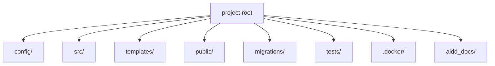

# Codebase Map

The macro layout: the top-level areas and what each holds. A map to navigate, not the full tree.

## Areas

- `config/`: Symfony configuration files and routes
- `src/`: PHP source code, entry point is Kernel.php
- `templates/`: Twig templates
- `public/`: Web root, entry point is index.php
- `migrations/`: Doctrine database migrations
- `tests/`: Test files and bootstrap
- `.docker/`: Docker configuration for FrankenPHP
- `aidd_docs/`: AI project documentation and memory

## Entry points

- `public/index.php`: Web entry point
- `bin/console`: CLI entry point