# Domain-Driven Design (DDD) + Clean Architecture

The project's DDD and Clean Architecture implementation guidelines, aligned with Hexagonal Architecture principles.

## Core Principles

The architecture follows **three complementary paradigms**:

1. **Clean Architecture** (Uncle Bob): Dependencies only point inwards (Infrastructure → Application → Domain).
2. **Hexagonal Architecture** (Ports & Adapters): Domain defines ports (interfaces), Infrastructure provides adapters (implementations).
3. **DDD-lite**: Pragmatic DDD without over-engineering (no CQRS by default, no complex patterns unless needed).

## Layer Structure

```
src/
├── Domain/                  # Domain Layer (Clean Architecture)
│   │
│   ├── {BoundedContext}/    # Logical separation via namespaces (e.g., User/, Order/)
│   │   ├── Entity/          # Domain entities with business rules
│   │   │   └── {Entity}.php  # e.g., User.php
│   │   │
│   │   ├── ValueObject/     # Immutable value objects
│   │   │   └── {VO}.php      # e.g., Email.php, Username.php
│   │   │
│   │   ├── Repository/      # Ports: Interfaces for persistence (Hexagonal)
│   │   │   └── {Entity}RepositoryInterface.php
│   │   │
│   │   ├── Event/           # Domain events
│   │   │   └── {Event}.php   # e.g., UserRegistered.php
│   │   │
│   │   └── Exception/       # Domain-specific exceptions
│   │       └── {Exception}.php
│   │
│   └── Shared/              # Truly shared domain concepts (use sparingly)
│       └── ValueObject/     # Generic value objects (e.g., Uuid, Money)
│
├── Application/             # Application Layer (Clean Architecture)
│   │
│   ├── {BoundedContext}/    # Mirrors Domain context structure
│   │   └── UseCase/         # Use cases (application-specific business rules)
│   │       └── {UseCase}/   # e.g., RegisterUser/
│   │           ├── {UseCase}UseCase.php
│   │           ├── {UseCase}Request.php
│   │           └── {UseCase}Response.php
│   │
│   └── Shared/              # Shared application logic (rare)
│
└── Infrastructure/          # Infrastructure Layer (Clean Architecture / Adapters)
    │
    ├── {BoundedContext}/    # Mirrors Domain context structure
    │   ├── Controller/      # Driving Adapters (HTTP, CLI)
    │   │   └── {Entity}Controller.php
    │   │
    │   ├── Repository/      # Driven Adapters (Doctrine implementations)
    │   │   └── Doctrine{Entity}Repository.php
    │   │
    │   └── Messenger/        # Driven Adapters (async message handlers)
    │       └── {Handler}.php
    │
    └── Shared/              # Shared infrastructure (e.g., Symfony services)
        ├── Controller/
        └── EventListener/
```

## Domain Layer Rules

The **Domain Layer** contains the **core business logic** and must be **completely independent** of frameworks, databases, and UI.

### Entities
- **Must** have rich behavior (not just getters/setters).
- **Must** enforce business invariants.
- **Must NOT** depend on Symfony, Doctrine, or any framework.
- **Should** raise Domain Events for state changes.

```php
// src/Domain/User/Entity/User.php
namespace App\Domain\User\Entity;

use App\Domain\User\ValueObject\Email;
use App\Domain\User\ValueObject\Username;
use App\Domain\User\Event\UserRegistered;
use App\Shared\ValueObject\Uuid;

final class User
{
    private function __construct(
        private Uuid $id,
        private Email $email,
        private Username $username,
        private string $hashedPassword,
        private \DateTimeImmutable $registeredAt,
    ) {}

    public static function register(
        Uuid $id,
        Email $email,
        Username $username,
        string $plainPassword,
    ): self {
        $user = new self(
            $id,
            $email,
            $username,
            password_hash($plainPassword, PASSWORD_BCRYPT),
            new \DateTimeImmutable(),
        );

        $user->raise(new UserRegistered($id, $email, $username));

        return $user;
    }

    public function id(): Uuid { return $this->id; }
    public function email(): Email { return $this->email; }
    public function username(): Username { return $this->username; }

    private function raise(object $event): void
    {
        // Dispatch event via Symfony EventDispatcher (injected or collected)
    }
}
```

### Value Objects
- **Must** be `final` and immutable.
- **Must** validate on construction.
- **Should** implement `__toString()` for display.
- **Should** implement equality comparison.

```php
// src/Domain/User/ValueObject/Email.php
namespace App\Domain\User\ValueObject;

use App\Domain\User\Exception\InvalidEmailException;

final readonly class Email
{
    public function __construct(private string $value)
    {
        if (!filter_var($value, FILTER_VALIDATE_EMAIL)) {
            throw new InvalidEmailException($value);
        }
    }

    public function value(): string
    {
        return $this->value;
    }

    public function __toString(): string
    {
        return $this->value;
    }

    public function equals(self $other): bool
    {
        return $this->value === $other->value;
    }
}
```

### Repository Interfaces (Ports)
- **Must** be defined in the Domain Layer.
- **Must** use Domain types (Entities, Value Objects) in signatures.
- **Must NOT** leak implementation details (e.g., no Doctrine types).

```php
// src/Domain/User/Repository/UserRepositoryInterface.php
namespace App\Domain\User\Repository;

use App\Domain\User\Entity\User;
use App\Domain\User\ValueObject\Email;

interface UserRepositoryInterface
{
    public function findByEmail(Email $email): ?User;
    public function save(User $user): void;
}
```

### Domain Events
- **Must** be immutable (`final`, readonly properties).
- **Must** be named in **past tense** (e.g., `UserRegistered`, not `RegisterUser`).
- **Must** contain all relevant data for handlers.
- **Should** extend Symfony's `Event` or implement a simple marker interface.

```php
// src/Domain/User/Event/UserRegistered.php
namespace App\Domain\User\Event;

use App\Domain\User\ValueObject\Email;
use App\Domain\User\ValueObject\Username;
use App\Shared\ValueObject\Uuid;
use Symfony\Contracts\EventDispatcher\Event;

final readonly class UserRegistered extends Event
{
    public const string NAME = 'user.registered';

    public function __construct(
        public Uuid $userId,
        public Email $email,
        public Username $username,
    ) {}
}
```

## Application Layer Rules

The **Application Layer** contains **application-specific business rules** (use cases, orchestration). It depends **only** on the Domain Layer.

### Use Cases
- **Must** orchestrate a single business workflow.
- **Must** depend only on Domain interfaces (Ports).
- **Must** convert between DTOs and Domain objects.
- **Must** handle errors gracefully (return DTOs with errors or throw Domain exceptions).

```php
// src/Application/User/UseCase/RegisterUser/RegisterUserUseCase.php
namespace App\Application\User\UseCase\RegisterUser;

use App\Domain\User\Entity\User;
use App\Domain\User\Repository\UserRepositoryInterface;
use App\Domain\User\ValueObject\Email;
use App\Domain\User\ValueObject\Username;
use App\Shared\ValueObject\Uuid;

final readonly class RegisterUserUseCase
{
    public function __construct(
        private UserRepositoryInterface $userRepository,
    ) {}

    public function execute(RegisterUserRequest $request): RegisterUserResponse
    {
        if ($this->userRepository->findByEmail($request->email) !== null) {
            throw new \DomainException('Email already in use');
        }

        $user = User::register(
            Uuid::random(),
            $request->email,
            $request->username,
            $request->password,
        );

        $this->userRepository->save($user);

        return new RegisterUserResponse(
            $user->id(),
            $user->email(),
            $user->username(),
        );
    }
}
```

### DTOs (Data Transfer Objects)
- **Request DTOs**: Input validation and transformation (used by controllers).
- **Response DTOs**: Output formatting for API/templates.
- **Must** be immutable where possible (`readonly`).
- **Must** validate on construction (use Symfony Validator attributes if needed).

```php
// src/Application/User/UseCase/RegisterUser/RegisterUserRequest.php
namespace App\Application\User\UseCase\RegisterUser;

use App\Domain\User\ValueObject\Email;
use App\Domain\User\ValueObject\Username;
use Symfony\Component\Validator\Constraints as Assert;

final readonly class RegisterUserRequest
{
    public function __construct(
        public Email $email,
        public Username $username,
        #[Assert\Length(min: 8)]
        public string $password,
    ) {}
}
```

```php
// src/Application/User/UseCase/RegisterUser/RegisterUserResponse.php
namespace App\Application\User\UseCase\RegisterUser;

use App\Domain\User\ValueObject\Email;
use App\Domain\User\ValueObject\Username;
use App\Shared\ValueObject\Uuid;

final readonly class RegisterUserResponse
{
    public function __construct(
        public Uuid $id,
        public Email $email,
        public Username $username,
    ) {}
}
```

## Infrastructure Layer Rules

The **Infrastructure Layer** contains **details** (frameworks, databases, UI). It depends on both **Domain** and **Application** layers.

### Controllers (Driving Adapters)
- **Must** be thin (delegate to Use Cases).
- **Must** only handle HTTP concerns (request/response, validation, serialization).
- **Must** use DTOs for input/output.
- **Must** return Symfony Response objects.

```php
// src/Infrastructure/User/Controller/UserController.php
namespace App\Infrastructure\User\Controller;

use App\Application\User\UseCase\RegisterUser\RegisterUserUseCase;
use App\Application\User\UseCase\RegisterUser\RegisterUserRequest;
use Symfony\Component\HttpFoundation\JsonResponse;
use Symfony\Component\HttpFoundation\Request;

final readonly class UserController
{
    public function __construct(
        private RegisterUserUseCase $registerUserUseCase,
    ) {}

    public function register(Request $request): JsonResponse
    {
        $dto = new RegisterUserRequest(
            new Email($request->request->get('email')),
            new Username($request->request->get('username')),
            $request->request->get('password'),
        );

        $response = $this->registerUserUseCase->execute($dto);

        return new JsonResponse([
            'id' => $response->id->value(),
            'email' => $response->email->value(),
            'username' => $response->username->value(),
        ]);
    }
}
```

### Repository Implementations (Driven Adapters)
- **Must** implement Domain repository interfaces.
- **Must** use Doctrine ORM (or other persistence technology).
- **Must NOT** contain business logic.

```php
// src/Infrastructure/User/Repository/DoctrineUserRepository.php
namespace App\Infrastructure\User\Repository;

use App\Domain\User\Entity\User;
use App\Domain\User\Repository\UserRepositoryInterface;
use App\Domain\User\ValueObject\Email;
use Doctrine\Bundle\DoctrineBundle\Repository\ServiceEntityRepository;

final class DoctrineUserRepository extends ServiceEntityRepository implements UserRepositoryInterface
{
    public function findByEmail(Email $email): ?User
    {
        return $this->findOneBy(['email' => $email->value()]);
    }

    public function save(User $user): void
    {
        $this->_em->persist($user);
        $this->_em->flush();
    }
}
```

### Message Handlers (Driven Adapters)
- **Must** be idempotent (handle duplicate messages safely).
- **Must** depend on Use Cases or Domain services, not the other way around.

```php
// src/Infrastructure/User/Messenger/SendWelcomeEmailHandler.php
namespace App\Infrastructure\User\Messenger;

use App\Application\User\UseCase\SendWelcomeEmail\SendWelcomeEmailUseCase;
use App\Application\User\UseCase\SendWelcomeEmail\SendWelcomeEmailRequest;
use Symfony\Component\Messenger\Attribute\AsMessageHandler;

#[AsMessageHandler]
final readonly class SendWelcomeEmailHandler
{
    public function __construct(
        private SendWelcomeEmailUseCase $sendWelcomeEmailUseCase,
    ) {}

    public function __invoke(SendWelcomeEmailRequest $request): void
    {
        $this->sendWelcomeEmailUseCase->execute($request);
    }
}
```

## Bounded Contexts

### What is a Bounded Context?
A **Bounded Context** is a **logical boundary** within which a particular model (definitions, rules, and meanings) applies. It helps manage complexity by:
- **Isolating** domain models that have different meanings in different parts of the system.
- **Reducing ambiguity** by explicitly defining where a model applies.
- **Enabling team autonomy** (different teams can work on different contexts independently).

### How to Identify Bounded Contexts?
Use **Event Storming** or **Domain Storytelling** to identify:
1. **Ubiquitous Language**: Terms that have a **specific meaning** within a context.
2. **Business Processes**: Workflows that are **cohesive** and **independent** of other workflows.
3. **Data Ownership**: Data that is **owned and modified** primarily within one area.

### Example Bounded Contexts for an E-Commerce App
| Bounded Context | Responsibility | Example Entities |
|------------------|----------------|------------------|
| **UserManagement** | User registration, authentication, profiles | User, Email, Username |
| **Catalog** | Product listings, categories, search | Product, Category, Price |
| **Order** | Order placement, status tracking | Order, OrderItem, OrderStatus |
| **Billing** | Payments, invoices, refunds | Payment, Invoice, Transaction |
| **Shipping** | Delivery addresses, tracking | Shipment, Address, TrackingInfo |

### Implementing Bounded Contexts in Code
- **Option 1 (Recommended for most projects)**: Use **namespaces** under `Domain/` and `Application/`.
  ```bash
  src/Domain/User/          # UserManagement context
  src/Domain/Order/         # Order context
  src/Application/User/     # UserManagement use cases
  src/Application/Order/    # Order use cases
  ```
- **Option 2 (For large projects)**: Use **physical directories** (only if namespaces are not enough).
  ```bash
  src/Contexts/UserManagement/Domain/
  src/Contexts/Order/Domain/
  ```

### Context Mapping
When two Bounded Contexts need to communicate, use:
1. **Domain Events**: For **one-way, eventual consistency** (e.g., `OrderPlaced` event triggers `Billing` context).
2. **Application Services**: For **synchronous, strong consistency** (e.g., `OrderService` calls `BillingService` within a transaction).
3. **Anti-Corruption Layer (ACL)**: When integrating with external systems (e.g., a legacy billing system).

## Event-Driven Architecture

The project uses **two mechanisms** for event-driven communication:

### 1. Domain Events (Synchronous)
- Raised within the **Domain Layer** (entities, domain services).
- Dispatched via **Symfony EventDispatcher** (immediately, same request).
- Handled **synchronously** by registered listeners.
- Used for **within-context** side effects (e.g., logging, notifications).

### 2. Async Messages (Asynchronous)
- Dispatched via **Symfony Messenger** (with Doctrine transport).
- Handled **asynchronously** by message handlers.
- Used for **cross-context** or **long-running** operations (e.g., sending emails, processing orders).
- **Must** be idempotent (handlers must handle duplicate messages safely).

### Event Flow Example

```mermaid
flowchart LR
    Domain[Domain Layer] -->|raises| DomainEvent[Domain Event]
    DomainEvent -->|dispatch| EventDispatcher[Symfony EventDispatcher]
    EventDispatcher -->|sync| SyncHandler[Sync Event Handler]
    SyncHandler -->|dispatch async| Messenger[Symfony Messenger]
    Messenger -->|persist| Queue[Doctrine Transport]
    Queue -->|consume| AsyncHandler[Async Message Handler]
```


## Dependency Flow (Clean Architecture)

```mermaid
flowchart TD
    Infrastructure[Infrastructure
(Adapters)] -->|depends on| Application[Application
(Use Cases)]
    Application -->|depends on| Domain[Domain
(Entities + Ports)]
    
    style Infrastructure fill:#f99,stroke:#333
    style Application fill:#9f9,stroke:#333
    style Domain fill:#99f,stroke:#333
```

**Rule**: Dependencies **only** point inwards. **Never** the other way around.

## Autowiring with PHP 8 Attributes

The project uses **PHP 8 attributes** for autowiring, eliminating the need for YAML configuration:

```php
// src/Infrastructure/User/Repository/DoctrineUserRepository.php
namespace App\Infrastructure\User\Repository;

use App\Domain\User\Repository\UserRepositoryInterface;
use Doctrine\Bundle\DoctrineBundle\Repository\ServiceEntityRepository;

#[AsRepository(service: UserRepositoryInterface::class)]
final class DoctrineUserRepository extends ServiceEntityRepository implements UserRepositoryInterface
{
    // Implementation
}
```

## Testing Strategy

| Layer | Test Type | Tools | Focus |
|-------|-----------|-------|-------|
| **Domain** | Unit tests | PHPUnit, Pest | Business rules, Value Objects, Entities |
| **Application** | Unit/Integration tests | PHPUnit, Pest | Use case orchestration, DTO validation |
| **Infrastructure** | Functional tests | PHPUnit, Symfony WebTestCase | HTTP endpoints, Doctrine integration |

### Domain Layer Testing
- Test **business rules** in isolation.
- Use **mock repositories** (interfaces).
- Test **Value Object validation**.
- Test **Domain Event raising**.

### Application Layer Testing
- Test **use case orchestration**.
- Use **real Domain layer** (no mocks for Domain objects).
- Mock **external services** (e.g., email service).

### Infrastructure Layer Testing
- Test **HTTP endpoints**.
- Test **Doctrine integration**.
- Use **test database**.

## Naming Conventions

| Concept | Convention | Example |
|---------|------------|---------|
| **Entity** | `{Name}` or `{Name}Entity` | `User`, `Order` |
| **Value Object** | `{Name}` or `{Name}Value` | `Email`, `Username` |
| **Repository (Interface)** | `{Name}RepositoryInterface` | `UserRepositoryInterface` |
| **Repository (Implementation)** | `Doctrine{Name}Repository` | `DoctrineUserRepository` |
| **Use Case** | `{Action}{Name}UseCase` | `RegisterUserUseCase` |
| **DTO (Request)** | `{Action}{Name}Request` | `RegisterUserRequest` |
| **DTO (Response)** | `{Action}{Name}Response` | `RegisterUserResponse` |
| **Domain Event** | `{Name}{PastTenseEvent}` | `UserRegistered` |
| **Controller** | `{Name}Controller` | `UserController` |
| **Message Handler** | `{Action}Handler` | `SendWelcomeEmailHandler` |

## Migration Path

For existing code, migrate gradually:

1. **Start with new features**: Implement the new architecture from scratch.
2. **Extract Domain Layer**: Move business logic to `Domain/{Context}/Entity/`.
3. **Introduce Ports**: Define repository interfaces in `Domain/{Context}/Repository/`.
4. **Move Use Cases**: Refactor application logic to `Application/{Context}/UseCase/`.
5. **Implement Adapters**: Move framework-specific code to `Infrastructure/`.
6. **Replace direct entity access**: Use DTOs in controllers and templates.

## When to Use This Architecture?

| Project Size | Recommendation |
|--------------|----------------|
| **Small** (1-2 domains) | Use **flat structure** (no context namespaces). |
| **Medium** (3-5 domains) | Use **namespaces** under `Domain/` and `Application/`. |
| **Large** (5+ domains) | Consider **physical directories** for contexts. |

## Key Takeaways

1. **Domain Layer is sacred**: It must **never** depend on frameworks or infrastructure.
2. **Dependencies flow inwards**: Infrastructure → Application → Domain.
3. **Bounded Contexts are logical**: Use namespaces to separate them.
4. **Ports & Adapters**: Domain defines interfaces (Ports), Infrastructure implements them (Adapters).
5. **Keep it simple**: Start with a flat structure and refactor as the project grows.
6. **Testability first**: Domain and Application layers must be testable in isolation.