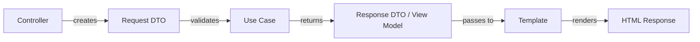

# Design

The project's UI design system and conventions, aligned with Clean Architecture principles.

## Stack

- Twig 3.x for templating
- Symfony TwigBundle for integration
- Bootstrap or custom CSS (not yet configured)

## Template Structure

Templates are part of the **Infrastructure Layer** (Driving Adapters in Hexagonal Architecture). They must:

1. **Only receive DTOs** (Data Transfer Objects) from controllers.
2. **Never access Domain entities directly** - use DTOs or View Models.
3. **Be dumb** - contain only presentation logic, no business rules.
4. **Follow naming conventions** (see below).

### Template Locations
```bash
templates/
├── user/                  # Mirrors Infrastructure/User/Controller/
│   ├── register.html.twig # Register user form
│   ├── profile.html.twig  # User profile page
│   └── list.html.twig     # List users
│
├── order/                 # Mirrors Infrastructure/Order/Controller/
│   ├── checkout.html.twig
│   └── history.html.twig
│
└── base.html.twig         # Base template (shared)
```

## DTOs and View Models

### Why DTOs?
- **Decoupling**: Templates should not depend on Domain entities (which may change).
- **Security**: DTOs can **filter sensitive data** (e.g., exclude `hashedPassword`).
- **Flexibility**: DTOs can **format data** for the view (e.g., `registeredAt` → `formattedDate`).

### View Model Pattern
For complex pages, use **View Models** instead of passing entities or DTOs directly:

```php
// src/Application/User/UseCase/GetUserProfile/GetUserProfileResponse.php
namespace App\Application\User\UseCase\GetUserProfile;

use App\Domain\User\ValueObject\Email;
use App\Domain\User\ValueObject\Username;
use App\Shared\ValueObject\Uuid;

final readonly class GetUserProfileResponse
{
    public function __construct(
        public Uuid $id,
        public Email $email,
        public Username $username,
        public \DateTimeImmutable $registeredAt,
        public int $orderCount,
    ) {}

    // Helper method for templates
    public function formattedRegisteredAt(): string
    {
        return $this->registeredAt->format('Y-m-d H:i:s');
    }
}
```

### Controller Usage
```php
// src/Infrastructure/User/Controller/UserController.php
public function profile(Request $request): Response
{
    $response = $this->getUserProfileUseCase->execute(new GetUserProfileRequest($request->get('userId')));
    
    return $this->render('user/profile.html.twig', [
        'profile' => $response, // Pass View Model/DTO to template
    ]);
}
```

### Template Usage
```twig
{# templates/user/profile.html.twig #}



<h1>User Profile</h1>
<p>Email: {{ profile.email }}</p>
<p>Username: {{ profile.username }}</p>
<p>Registered: {{ profile.formattedRegisteredAt() }}</p>
<p>Orders: {{ profile.orderCount }}</p>

```

## Template Conventions

### Naming
- **File names**: `{entity}{action}.html.twig` (e.g., `user_register.html.twig`, `user_profile.html.twig`).
- **Directories**: Group by **Bounded Context** (e.g., `templates/user/`, `templates/order/`).
- **Base template**: `templates/base.html.twig` (shared across all contexts).

### Structure
- **Base template** (`base.html.twig`): Contains common layout (header, footer, navigation).
- **Context templates** (e.g., `user/`): Contain templates for a specific Bounded Context.
- **Partial templates**: Use `_` prefix for partials (e.g., `_form.html.twig`).

### Example Structure
```bash
templates/
├── base.html.twig
├── _flash_messages.html.twig  # Shared partial
├── user/
│   ├── _form.html.twig       # Partial for user form
│   ├── register.html.twig
│   ├── login.html.twig
│   └── profile.html.twig
└── order/
    ├── _item.html.twig       # Partial for order item
    ├── checkout.html.twig
    └── history.html.twig
```

## Form Handling

### Form DTOs
Use **separate DTOs** for form submission (different from View Models):

```php
// src/Application/User/UseCase/RegisterUser/RegisterUserRequest.php
namespace App\Application\User\UseCase\RegisterUser;

use App\Domain\User\ValueObject\Email;
use App\Domain\User\ValueObject\Username;
use Symfony\Component\Validator\Constraints as Assert;

final readonly class RegisterUserRequest
{
    public function __construct(
        #[Assert\NotBlank]
        #[Assert\Email]
        public string $email,
        #[Assert\NotBlank]
        #[Assert\Length(min: 3, max: 20)]
        public string $username,
        #[Assert\NotBlank]
        #[Assert\Length(min: 8)]
        public string $password,
    ) {}
}
```

### Controller Handling
```php
// src/Infrastructure/User/Controller/UserController.php
public function register(Request $request): Response
{
    $dto = new RegisterUserRequest(
        $request->request->get('email'),
        $request->request->get('username'),
        $request->request->get('password'),
    );

    // Validate DTO (Symfony Validator will handle constraints)
    $errors = $this->validator->validate($dto);
    if (count($errors) > 0) {
        return $this->render('user/register.html.twig', [
            'errors' => $errors,
            'form' => $dto,
        ]);
    }

    $this->registerUserUseCase->execute($dto);
    
    return $this->redirectToRoute('user_profile');
}
```

### Template Form Rendering
```twig
{# templates/user/register.html.twig #}



<h1>Register</h1>


    <div class="alert alert-danger">
        
            <p>{{ error.message }}</p>
        
    </div>


<form method="post">
    <div>
        <label>Email:</label>
        <input type="email" name="email" value="{{ form.email ?? '' }}" required>
    </div>
    <div>
        <label>Username:</label>
        <input type="text" name="username" value="{{ form.username ?? '' }}" required>
    </div>
    <div>
        <label>Password:</label>
        <input type="password" name="password" required>
    </div>
    <button type="submit">Register</button>
</form>

```

## Current State

- Empty `templates/` directory
- No base template defined
- No CSS framework configured
- TwigBundle installed and ready for use
- Ready for Clean Architecture-compliant template structure

## Best Practices

1. **Keep templates dumb**: No business logic in templates (use View Models or DTOs).
2. **Use DTOs for input**: Never pass raw request data to Domain Layer.
3. **Use View Models for output**: Never pass Domain entities directly to templates.
4. **Validate early**: Validate DTOs in controllers before passing to Use Cases.
5. **Separate concerns**: Use partial templates (`_form.html.twig`) for reusable components.
6. **Avoid N+1 queries**: Pre-load all data needed for the template in the Use Case.

## Integration with Clean Architecture



### Layer Responsibilities
| Layer | Responsibility in Design |
|-------|---------------------------|
| **Domain** | Define data structures (Entities, Value Objects) |
| **Application** | Define DTOs, View Models, and Use Cases |
| **Infrastructure** | Render templates, handle form submissions |

## Summary

- **Templates are Adapters**: Part of the Infrastructure Layer (Hexagonal Architecture).
- **Use DTOs/View Models**: Never pass Domain entities directly to templates.
- **Keep it simple**: Templates should only handle presentation logic.
- **Validate early**: Use Symfony Validator with DTOs for form validation.
- **Organize by context**: Group templates by Bounded Context (e.g., `templates/user/`, `templates/order/`).