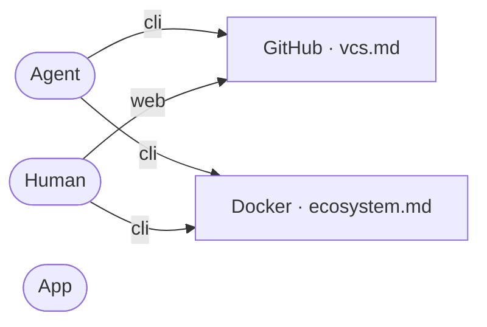

# Ecosystem

```mermaid
flowchart LR
  Human([Human])
  Agent([Agent])
  App([App])
  GitHub["GitHub · vcs.md"]
  Docker["Docker · ecosystem.md"]

  Agent -- cli --> GitHub
  Human -- web --> GitHub
  Agent -- cli --> Docker
  Human -- cli --> Docker
```