# Messaging

The project's async message processing setup, integrated with Clean Architecture and Domain-Driven Design.

## Stack

- Symfony Messenger component
- Doctrine Messenger transport
- Async message handling
- Symfony EventDispatcher for synchronous domain events

## Architecture Integration

The project uses **two complementary mechanisms** for event-driven communication, aligned with **Clean Architecture** and **Hexagonal Architecture**:

### 1. Domain Events (Synchronous)
- **Layer**: Domain Layer (raised) + Infrastructure Layer (handled)
- **Purpose**: Immediate, in-request communication within a Bounded Context.
- **Mechanism**: Symfony EventDispatcher (synchronous).
- **Use Case**: Side effects that must happen **within the same request** (e.g., logging, auditing, triggering async processes).

### 2. Async Messages (Asynchronous)
- **Layer**: Application Layer (dispatched) + Infrastructure Layer (handled)
- **Purpose**: Decoupled, delayed processing across Bounded Contexts.
- **Mechanism**: Symfony Messenger with Doctrine transport.
- **Use Case**: Long-running operations, cross-context communication (e.g., sending emails, processing orders).

### Flow Diagram

```mermaid
flowchart LR
    Domain[Domain Layer] -->|raises| DomainEvent[Domain Event]
    DomainEvent -->|dispatch| EventDispatcher[Symfony EventDispatcher]
    EventDispatcher -->|sync| SyncHandler[Sync Event Handler]
    
    App[Application Layer] -->|dispatches| AsyncMessage[Async Message]
    AsyncMessage -->|via| Messenger[Symfony Messenger]
    Messenger -->|persists| Queue[Doctrine Transport]
    Queue -->|consumes| AsyncHandler[Async Message Handler]
    
    AsyncHandler -->|calls| UseCase[Use Case]
    UseCase -->|uses| Domain[Domain Layer]
```


## Current State

- Messenger configured with Doctrine transport in `config/packages/messenger.yaml`
- Symfony EventDispatcher configured (built-in)
- No message classes defined yet
- No message handlers created yet
- Ready for both sync (domain events) and async (messenger) workflows

## Configuration

### Messenger Configuration
- **Transport**: Doctrine (persists messages in the database).
- **Serializer**: Symfony Serializer (normalizes/denormalizes messages).
- **Retry**: Configured for transient failures (exponential backoff).
- **Configuration File**: `config/packages/messenger.yaml`

### EventDispatcher Configuration
- **Built-in**: No additional configuration needed (Symfony standard).
- **Usage**: Inject `Symfony\Contracts\EventDispatcher\EventDispatcherInterface` where needed.

## Message Types

### Domain Events
- **Location**: `src/Domain/{Context}/Event/`
- **Purpose**: Represent **facts** that occurred in the domain (e.g., `UserRegistered`, `OrderPlaced`).
- **Characteristics**:
  - Must be **immutable** (`final`, readonly properties).
  - Must be **named in past tense** (e.g., `UserRegistered`, not `RegisterUser`).
  - Must contain **all relevant data** for handlers.
  - Must extend `Symfony\Contracts\EventDispatcher\Event`.

```php
// src/Domain/User/Event/UserRegistered.php
namespace App\Domain\User\Event;

use App\Domain\User\ValueObject\Email;
use App\Domain\User\ValueObject\Username;
use App\Shared\ValueObject\Uuid;
use Symfony\Contracts\EventDispatcher\Event;

final readonly class UserRegistered extends Event
{
    public const string NAME = 'user.registered';

    public function __construct(
        public Uuid $userId,
        public Email $email,
        public Username $username,
    ) {}
}
```

### Async Messages
- **Location**: `src/Application/{Context}/UseCase/{UseCase}/` (as DTOs) or `src/Application/{Context}/Message/`
- **Purpose**: Represent **commands** or **queries** to be processed asynchronously.
- **Characteristics**:
  - Must be **serializable** (no closures, no circular references).
  - Must have **retry configuration** (in `config/packages/messenger.yaml`).
  - Must be **idempotent** (handlers must handle duplicates safely).
  - No interface required (simple PHP classes).

```php
// src/Application/User/Message/SendWelcomeEmail.php
namespace App\Application\User\Message;

use App\Domain\User\ValueObject\Email;
use App\Shared\ValueObject\Uuid;

final readonly class SendWelcomeEmail
{
    public function __construct(
        public Uuid $userId,
        public Email $email,
    ) {}
}
```

## Handler Patterns

### Domain Event Listeners (Synchronous)
- **Location**: `src/Infrastructure/{Context}/EventListener/`
- **Purpose**: Handle domain events **synchronously** within the same request.
- **Best Practices**:
  - Keep handlers **fast** (avoid I/O operations if possible).
  - Dispatch **async messages** for long-running tasks.
  - Use **Use Cases** for complex logic (delegate to `Application/` layer).

```php
// src/Infrastructure/User/EventListener/OnUserRegistered.php
namespace App\Infrastructure\User\EventListener;

use App\Domain\User\Event\UserRegistered;
use App\Application\User\Message\SendWelcomeEmail;
use Symfony\Component\Messenger\MessageBusInterface;
use Symfony\Component\Messenger\Attribute\AsMessageHandler;

final readonly class OnUserRegistered
{
    public function __construct(
        private MessageBusInterface $messageBus,
    ) {}

    #[AsEventListener(event: UserRegistered::NAME)]
    public function onUserRegistered(UserRegistered $event): void
    {
        // Dispatch async message for welcome email
        $this->messageBus->dispatch(new SendWelcomeEmail(
            $event->userId,
            $event->email,
        ));
    }
}
```

### Async Message Handlers
- **Location**: `src/Infrastructure/{Context}/Messenger/`
- **Purpose**: Handle async messages **asynchronously** (via Messenger).
- **Best Practices**:
  - **Must be idempotent**: Handle duplicate messages safely (e.g., check if email was already sent).
  - **Use Use Cases**: Delegate business logic to `Application/` layer.
  - **Avoid throwing exceptions**: Log failures but do not throw (Messenger will retry).

```php
// src/Infrastructure/User/Messenger/SendWelcomeEmailHandler.php
namespace App\Infrastructure\User\Messenger;

use App\Application\User\Message\SendWelcomeEmail;
use App\Application\User\UseCase\SendWelcomeEmail\SendWelcomeEmailUseCase;
use Symfony\Component\Messenger\Attribute\AsMessageHandler;

#[AsMessageHandler]
final readonly class SendWelcomeEmailHandler
{
    public function __construct(
        private SendWelcomeEmailUseCase $sendWelcomeEmailUseCase,
    ) {}

    public function __invoke(SendWelcomeEmail $message): void
    {
        // Delegate to Use Case (Application Layer)
        $this->sendWelcomeEmailUseCase->execute($message);
    }
}
```

## Best Practices

### Domain Events
- **Keep them small**: Each event should represent **one fact** (e.g., `UserRegistered`, not `UserRegisteredAndEmailSent`).
- **Include all relevant data**: Handlers should not need to fetch additional data.
- **Avoid business logic**: Events are **facts**, not commands. Business logic belongs in Entities or Use Cases.
- **Dispatch synchronously**: Use Symfony EventDispatcher for immediate handling.

### Async Messages
- **Use for cross-context communication**: If an operation affects multiple Bounded Contexts, use async messages.
- **Ensure idempotency**: Handlers must be able to process the same message multiple times without side effects.
- **Configure retries**: Use exponential backoff for transient failures (configured in `messenger.yaml`).
- **Include correlation IDs**: For tracing messages across contexts (e.g., `order_id` in `ProcessOrder` message).

### Handler Design
- **Thin handlers**: Delegate business logic to **Use Cases** (Application Layer).
- **Stateless**: Handlers should not maintain state between calls.
- **Error handling**: Log errors but **do not throw exceptions** (Messenger will retry).
- **Idempotency keys**: Use unique keys (e.g., `user_id` + `message_type`) to detect duplicates.

## Example: Full Event-Driven Flow

### 1. Domain Event Raised
```php
// src/Domain/User/Entity/User.php
public static function register(Uuid $id, Email $email, Username $username, string $password): self
{
    $user = new self(/* ... */);
    $user->raise(new UserRegistered($id, $email, $username));
    return $user;
}
```

### 2. Domain Event Handled (Sync)
```php
// src/Infrastructure/User/EventListener/OnUserRegistered.php
#[AsEventListener(event: UserRegistered::NAME)]
public function onUserRegistered(UserRegistered $event): void
{
    $this->messageBus->dispatch(new SendWelcomeEmail($event->userId, $event->email));
}
```

### 3. Async Message Handled
```php
// src/Infrastructure/User/Messenger/SendWelcomeEmailHandler.php
#[AsMessageHandler]
public function __invoke(SendWelcomeEmail $message): void
{
    $this->sendWelcomeEmailUseCase->execute($message);
}
```

### 4. Use Case Executed
```php
// src/Application/User/UseCase/SendWelcomeEmail/SendWelcomeEmailUseCase.php
public function execute(SendWelcomeEmail $message): void
{
    // Business logic here (e.g., send email via a service)
}
```

## Configuration Example

### `config/packages/messenger.yaml`
```yaml
framework:
    messenger:
        transports:
            async: '%env(MESSENGER_TRANSPORT_DSN)%'
        routing:
            'App\Application\User\Message\SendWelcomeEmail': async
            'App\Application\Order\Message\ProcessOrder': async
```

## Common Pitfalls

| Pitfall | Solution |
|---------|----------|
| **Handlers with business logic** | Move logic to Use Cases (Application Layer). |
| **Non-idempotent handlers** | Add checks (e.g., `if email not sent, send it`). |
| **Large events** | Split into smaller events or use DTOs for complex data. |
| **Circular dependencies** | Use Domain Events to decouple contexts. |
| **Blocking sync handlers** | Dispatch async messages for long-running tasks. |

## Testing Messaging

### Testing Domain Event Listeners
```php
// tests/Infrastructure/User/EventListener/OnUserRegisteredTest.php
public function testOnUserRegisteredDispatchesAsyncMessage(): void
{
    $messageBus = $this->createMock(MessageBusInterface::class);
    $messageBus->expects($this->once())
        ->method('dispatch')
        ->with($this->isInstanceOf(SendWelcomeEmail::class));

    $listener = new OnUserRegistered($messageBus);
    $listener->onUserRegistered(new UserRegistered(/* ... */));
}
```

### Testing Async Message Handlers
```php
// tests/Infrastructure/User/Messenger/SendWelcomeEmailHandlerTest.php
public function testHandlerDelegatesToUseCase(): void
{
    $useCase = $this->createMock(SendWelcomeEmailUseCase::class);
    $useCase->expects($this->once())
        ->method('execute')
        ->with($this->isInstanceOf(SendWelcomeEmail::class));

    $handler = new SendWelcomeEmailHandler($useCase);
    $handler->__invoke(new SendWelcomeEmail(/* ... */));
}
```

## Summary

- **Domain Events**: Synchronous, within-request, handled by EventDispatcher.
- **Async Messages**: Asynchronous, cross-context, handled by Messenger.
- **Handlers**: Thin, delegate to Use Cases, idempotent.
- **Use Cases**: Contain business logic, testable in isolation.
- **Bounded Contexts**: Logical separation via namespaces (e.g., `User/`, `Order/`).